---

title: Time Control  
---

# TIME CONTROL  

Let's see how to configure time control for the first time.  

## 1. Module Activation  

First, click on the **tools icon (gear)** and select the option: **CONFIGURE MODULES**.  

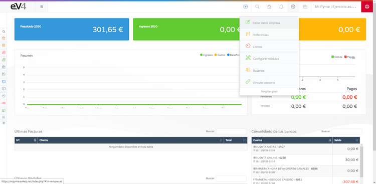

On the **MODULE ACTIVATION AND CONFIGURATION** screen, you will find the list of available modules, from here you can access their configuration.  

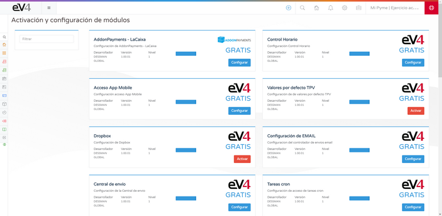

Select the **TIME CONTROL** module and click the **CONFIGURE** button.  

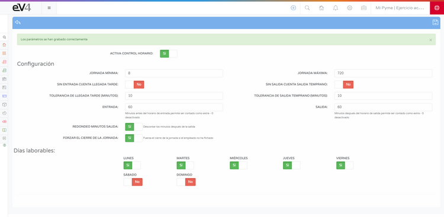

By default, the module is **deactivated**. To activate it:  

1. Click the white box next to **NO**, and it will turn green to **YES**.  
2. Configure the desired options.  
3. Click the **disk icon** on the right side of the blue top bar to save the changes.  

You will see a message informing you that **THE PARAMETERS HAVE BEEN SAVED CORRECTLY**.  

Click the **arrow icon** on the left side of the blue top bar to return to the **MODULE ACTIVATION AND CONFIGURATION** screen.  

## 2. Configuring Access to the Mobile App  

1. Click on the **CONFIGURE** button for the **MOBILE APP ACCESS** module.  

2. Enable the **ACTIVATE EV4APP ACCESS** option and leave the switch in **YES (green)**.  

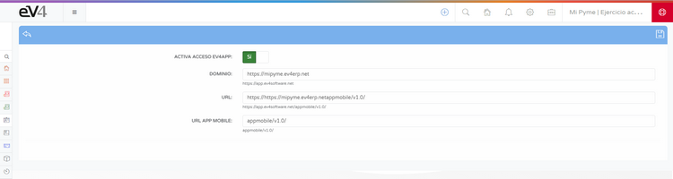

3. Click the **disk icon** to save the configuration.  

Now, we have activated **TIME CONTROL** in our ERP and mobile app access for time tracking.  

## 3. Assigning Users to Employees  

Go to the **HR → EMPLOYEES** section and select an employee.  

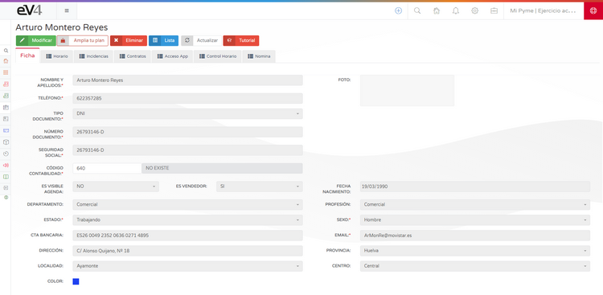

Two new tabs will appear:  

- **App Access:** For configuring the registration in the mobile app.  
- **Time Control:** To view the history and clock in from the PC.  

Initially, no user is assigned, so we need to assign it manually.  

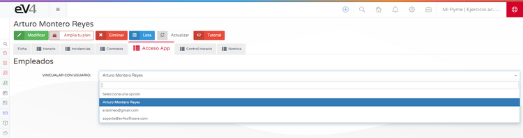

1. Select the employee’s user.  

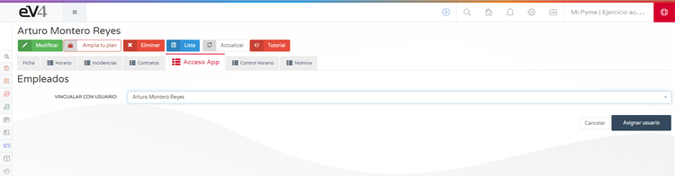

2. Click the **ASSIGN USER** button.  

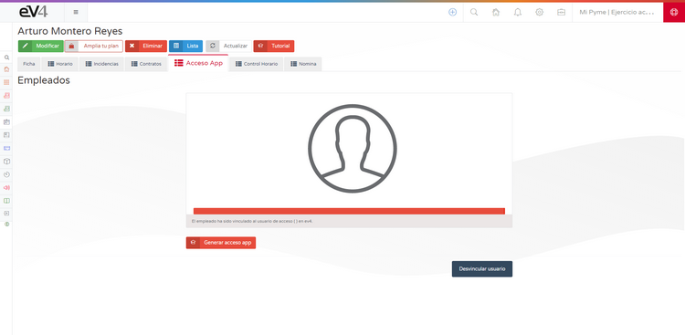

3. Click the **GENERATE APP ACCESS** button.  

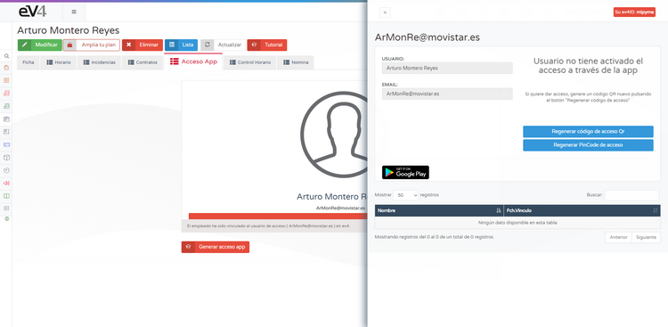

## 4. Mobile App Access Methods  

### Option 1: QR Code  

1. Click the **REGENERATE QR ACCESS CODE** button.  
2. The user must **scan the QR code** in the mobile app.  
3. To send the QR code by email, click the **SEND QR ACCESS EMAIL** button.  

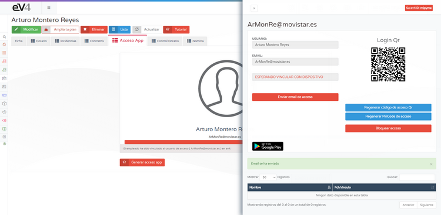

### Option 2: PinCode  

1. Click the **REGENERATE PINCODE ACCESS** button.  
2. The user must manually enter the following data into the mobile app:  
   - **EvID**  
   - **PinCode**  
3. To send the access data by email, click the **SEND ACCESS EMAIL** button.  

## 5. Configuring the Employment Contract  

To define the user’s workday, we need to create a **contract** specifying the start time, end time, and whether it's a continuous workday or not.  

1. Go to the **CONTRACTS** tab in the employee's profile.  

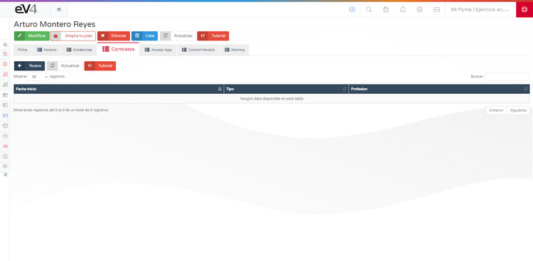

2. Click the **NEW** button.  

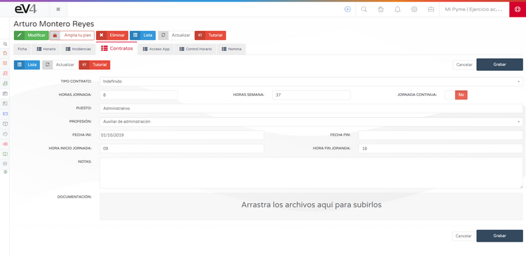

3. Fill in the required fields, especially:  
   - **Number of work hours**  
   - **Whether it's a continuous workday or not**  
   - **Start and end time of the workday**  
4. Click the **SAVE** button.  

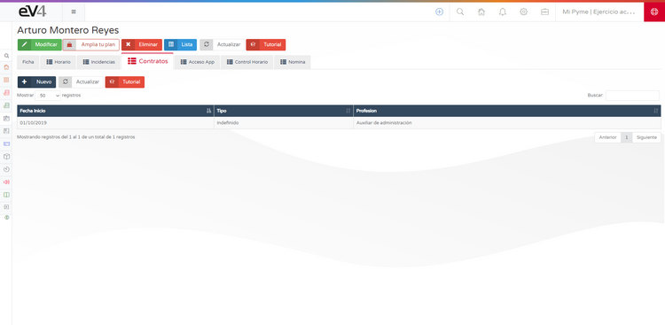

Once users are assigned and a contract is completed, employees can clock in.  

## 6. Workday Registration  

To clock in from the PC, go to the **HR → TIME CONTROL** section.  

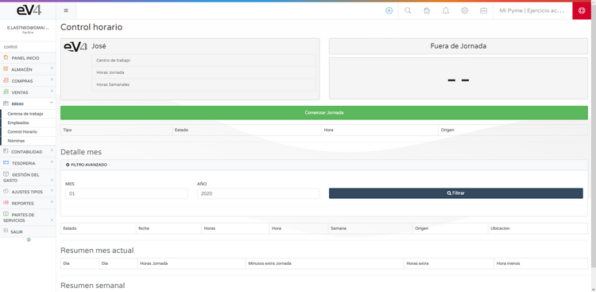

- **To start the workday**, click the green **START DAY** button.  

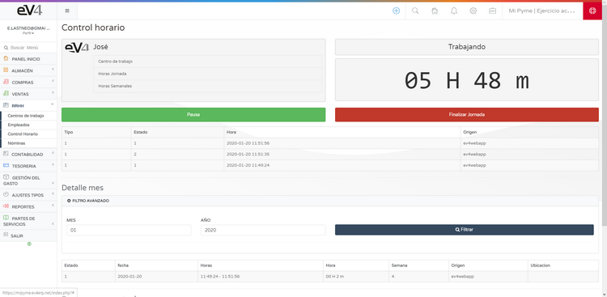

- **To end the workday**, click the red **END DAY** button.  
