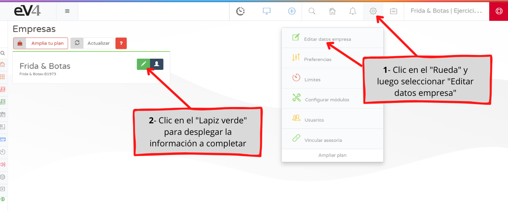
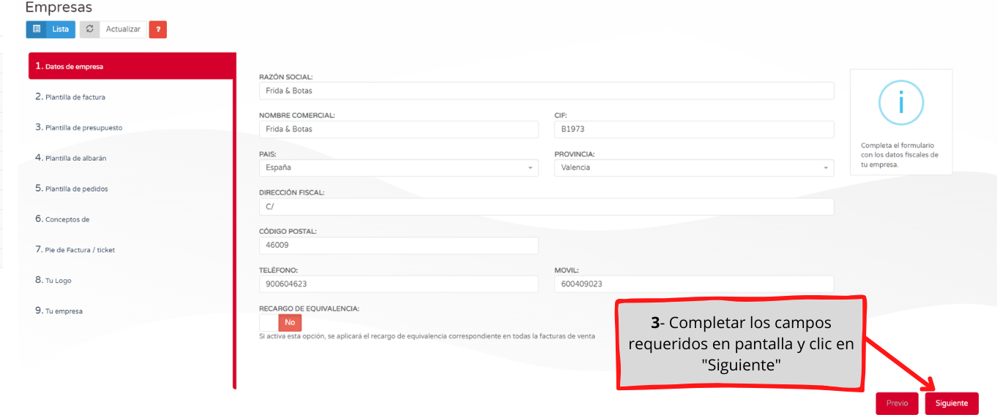
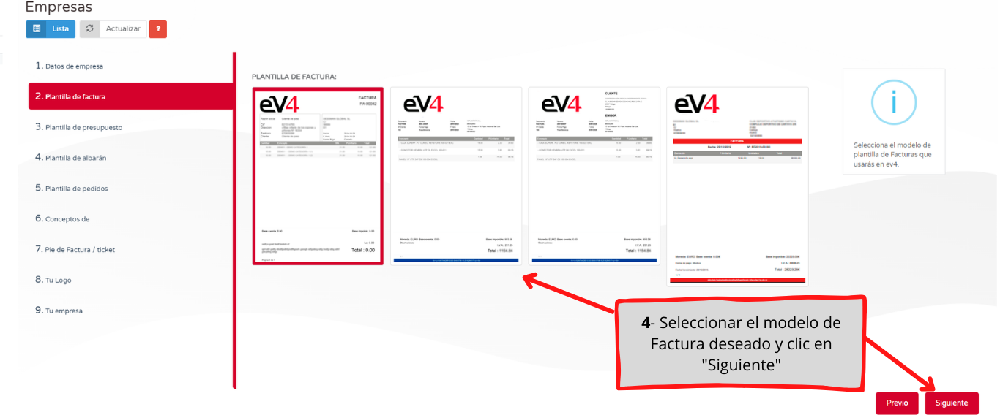
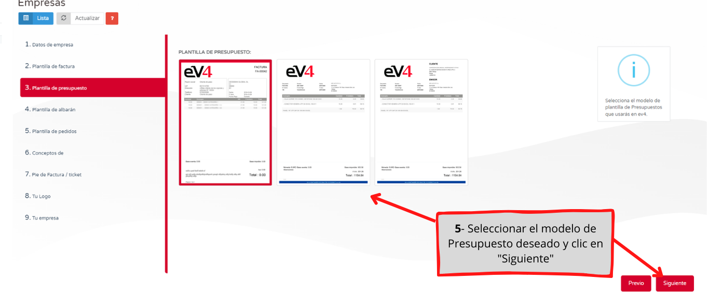
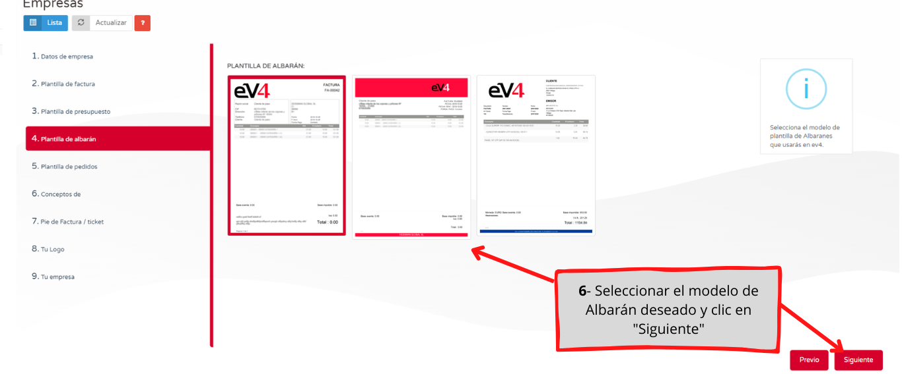
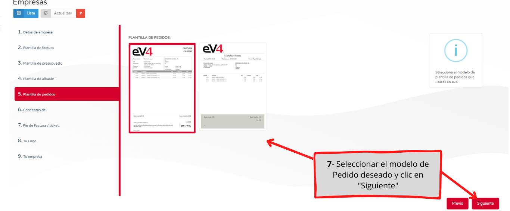
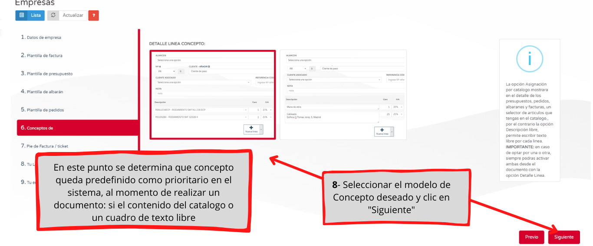
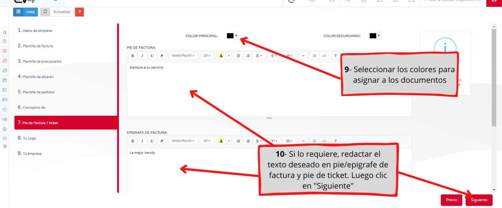
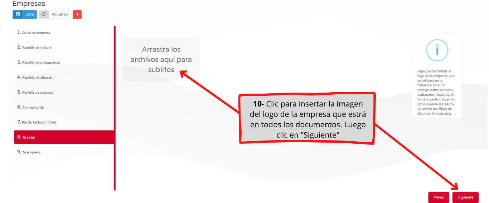
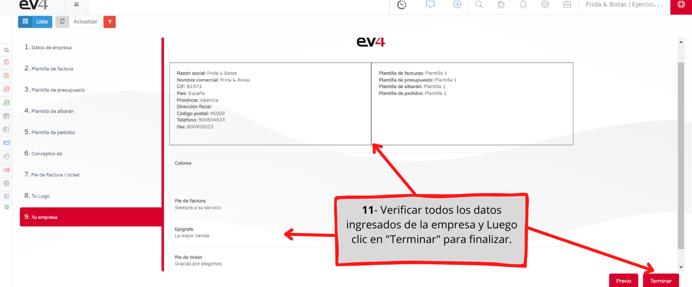

---

title: Company / Freelancer Configuration  
description: Here we show you how to complete your company details and configure document templates (order, delivery note, invoice) to start managing your company with ev4.  
---

Here we show you how to complete your company details and configure document templates (order, delivery note, invoice) to start managing your company with ev4.

  
  
  
  
  
  
  
  
  
  
