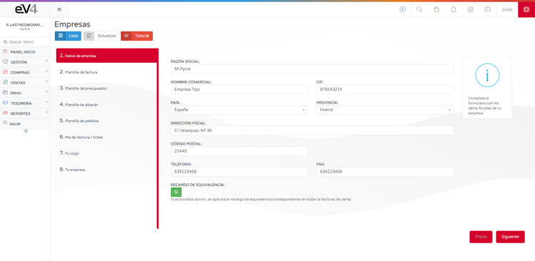
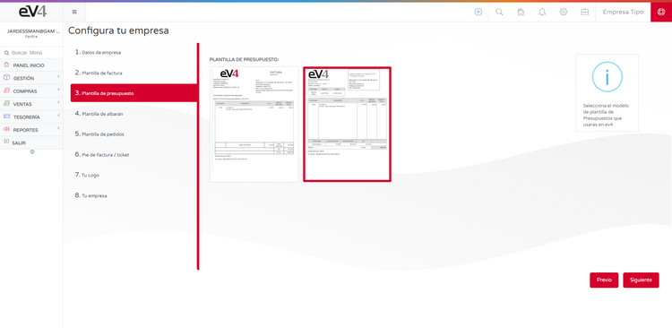
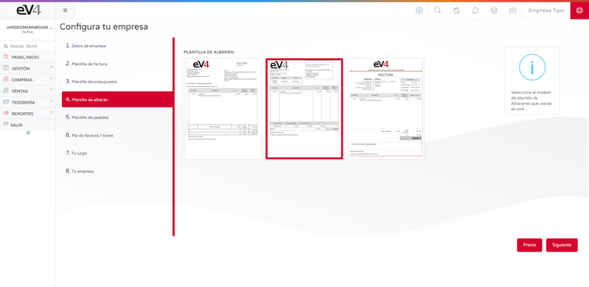

---

title: Configuration Assistant Tips  
description: The initial configuration assistant allows us to configure the basic aspects of the system in eight steps in a quick and easy way.  
---

#### 1. COMPANY DETAILS

- **LEGAL NAME**: Legal name of the company.  
- **TRADE NAME**: Name of the company.  
- **VAT NUMBER**: Tax Identification Number of the company.  
- **COUNTRY**: Country where the company is registered.  
- **PROVINCE**: Province where the company is registered.  
- **TAX ADDRESS**: Address where the company is registered.  
- **POSTAL CODE**: Postal code of the location where the company is registered.  
- **PHONE**: Phone number of the company.  
- **FAX**: Fax number of the company.  
- **EQUIVALENCE SURCHARGE**: YES/NO. If enabled, the corresponding equivalence surcharge will be applied to all sales invoices.  

#### 2. INVOICE TEMPLATE

In this screen, we can select the template the system will use for invoices. We just need to click on the chosen template and then press the **NEXT** button.

#### 3. QUOTE TEMPLATE

In this screen, we can select the template the system will use for quotes. We just need to click on the chosen template and then press the **NEXT** button.

#### 4. DELIVERY NOTE TEMPLATE

In this screen, we can select the template the system will use for delivery notes. We just need to click on the chosen template and then press the **NEXT** button.

#### 5. ORDER TEMPLATE

In this screen, we can select the template the system will use for orders. We just need to click on the chosen template and then press the **NEXT** button.

#### 6. INVOICE/TICKET FOOTER

In this screen, we can customize the text that will appear in the footer of invoices, tickets, and the invoice heading. Once finished, we just need to press the **NEXT** button.

#### 7. YOUR LOGO

In this screen, you can add your company's logo. The image dimensions must be 280 x 72 pixels and in PNG format.

Click on the trash can icon to remove the existing image, then drag your company logo to this place, and finally press the **NEXT** button.

#### 8. YOUR COMPANY

In this last step, we have a summary of all the adjustments made.

Now we can verify that all the data is correct. If so, click the **FINISH** button. If not, click the **PREVIOUS** button as many times as necessary until we reach the screen where we need to correct the data.

