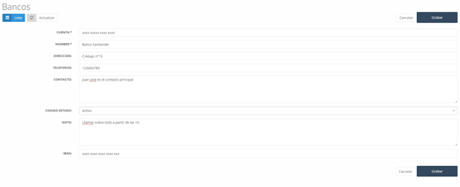

---

title: Bank Test  
description: In this section, we find the list of different banks with which the company works, either for managing company accounts or other related operations.  
---

#### Banks

In this section, we find the list (see Image 25: Bank List) of different banks the company works with, either for managing the company’s accounts or for other operations the company requires.

##### 5.4.1 Banks – New

We can add a new bank to the list by clicking the **New** button and filling out the form (see Image 26: New Bank) that will appear with the following fields:

- **Account**: Bank account number.
- **Entity**: Bank entity code.
- **Branch**: Branch code.
- **DC**: Account number.
- **Name**: Bank name.
- **Address**: Branch address.
- **Phone Numbers**: Bank contact phone number.
- **Contact**: Name of the contact person.
- **Status Code**: Bank status in the system.
- **Note**: Informational note about the bank.
- **IBAN**: IBAN of the entered bank.

#### Discounts

When accessing discounts, the main screen shows a list of the discounts (see Image 27: Discounts) available in the system, which can later be associated with each client. Additionally, they can have a date range during which they are valid and can be applied to a specific product or catalog.

