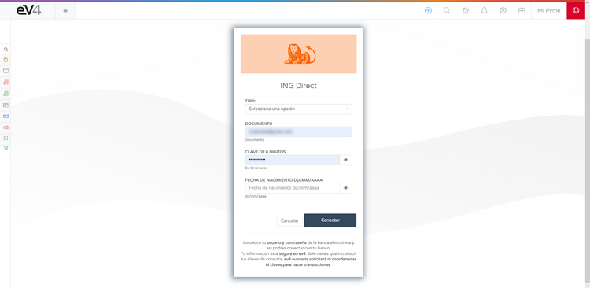
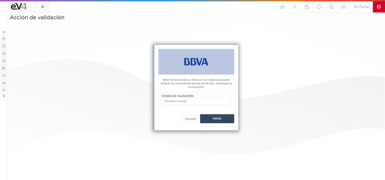
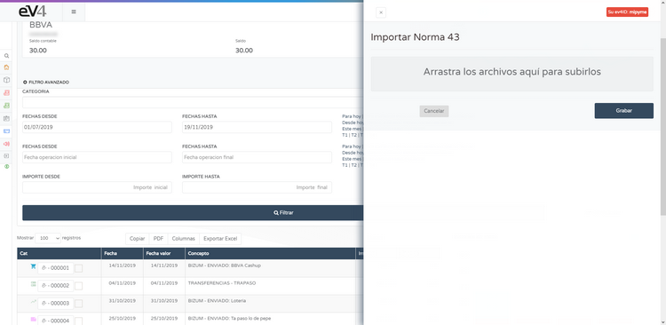
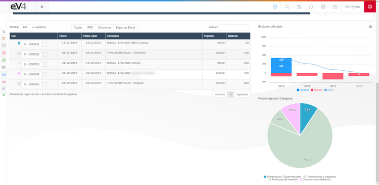

#### Connect with Your Bank

eV4 allows you to connect with your bank to consult your bank transactions. eV4 only has access to your bank data in read-only mode, meaning it can only view such data. **It will never** perform financial operations (payments, transfers, etc.).

This function is located in the menu **TREASURY → BANKS.**

The first time you access this, you will see the following screen.

Click on the **CONNECT WITH YOUR BANK** button, and you will see the next screen where you need to select your banking institution.

eV4 can work with over 100 banking institutions in Europe and America. You can filter the banking institutions by country by clicking on it or search for them directly by name. Once you find it, click on it.

eV4 adapts to the way each bank works and will ask for the data required by that bank.

Once the required data is entered, click the connect button.

The first time eV4 connects with your bank, it will request the transactions of the last year. To request transactions from periods longer than 90 days, in compliance with European regulations, your bank must provide a control code, which you must enter next.

Click the **VALIDATE** button and wait for the process to complete. Then, the accounts you have at that banking institution will appear on the screen.

If any of the accounts has a red symbol of an "i" inside a circle, it means the user needs to take action. If you click on an account, you enter it.

Follow the instructions; in this case, click on the button **CLICK TO REACTIVATE ACCOUNT.**

And wait for it to finish.

In the upper area of the screen, there is a drop-down menu **TOOLS** with the following options:

- **UPDATE ALL ACCOUNTS**: Updates the transactions of all accounts.
- **UPDATE TRANSACTIONS**: Updates the transactions of this account.
- **GROUPED RECONCILIATION**: Opens the window to reconcile the transactions with invoices.
- **IMPORT STANDARD 43**: Imports the file of standard 43 provided by the bank.

- **ASSIGN VALIDATION CODE**: When reactivating an account, it opens the window to enter the verification code.

In the upper area of the screen, there is another drop-down menu **OTHER ACCOUNTS**, from which you can jump to another account directly, without passing through the banks screen.

Once the transactions are downloaded, you can filter the time period you want to view by specifying the desired date range in the **ADVANCED FILTER**.

Above the list of transactions, there are 4 buttons:

- **COPY**: Copies all the transactions to the clipboard.
- **PDF**: Generates a PDF document with the transactions.

- **COLUMNS**: Displays a menu where you can select which columns you want to show in the transaction list.

- **EXPORT TO EXCEL**: Generates a spreadsheet in EXCEL format with the list of transactions.

##### BANK RECONCILIATION
Bank reconciliation, in broad terms, refers to a part of the company's treasury management. That is, the company must justify each bank transaction with its corresponding operation, which is understood as bank reconciliation.

Bank reconciliation is the action of matching each bank transaction with our operations. It consists of matching the different transactions from the bank with our invoices. Determining that each transaction is part of an invoice.

To reconcile a transaction with an invoice, we first need to select a transaction by marking the checkbox to the right of its number and then selecting **GROUPED RECONCILIATION** in the **TOOLS** menu.

If no transaction is selected first, we will see the following error message.

You will then see the following screen.

You can classify the transactions into different categories, each category having its own icon.

At the bottom right, there are 4 tabs:

- **RECONCILED INVOICES**: Here, you will see the invoice reconciled with this transaction.
- **SALES**: Here, you will see the sales invoices available in the system.
- **PURCHASES**: Here, you will see the purchase invoices available in the system.
- **ASSISTANT**: Here, you will see the invoices the system suggests may be related to the transaction.

To reconcile the transaction with an invoice, select it from the available invoices, whether sales, purchases, or suggested by the system, and click the **RECONCILE** button.

The selected invoice will now appear in the **RECONCILED INVOICES** tab. If you want to un-reconcile the invoice, simply click the **UNRECONCILE** button.

Once the transactions are classified, the graphs on the right side of the screen are interactive.

In the bar graph, you can toggle the data corresponding to **INCOME**, **EXPENSES**, and **BALANCE** by clicking on their names.

The pie chart assigns a color for each category that we have assigned to the transactions, and by clicking on its section in the graph, we can filter the transactions by that category.

To return to the full list of transactions, click on the legend at the bottom that details the assigned categories.
