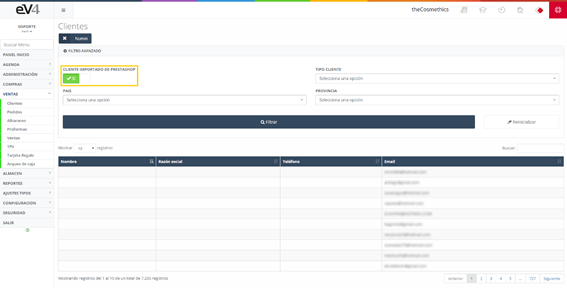

#### Clients

A list of the existing clients of the company, along with their invoices, discounts, and contacts.

#### CLIENTS - Initial View

This is the initial view of the **“CLIENTS”** section. Initially, the search fields are blank. When a search is made, the fields will retain the values entered in them, in case it is necessary to repeat a search with these data.

If we want to reset the template to its initial state and clear the last search data, we can do so by clicking the **“Reset”** button.

Another important button is the **“CLIENT IMPORTED FROM PRESTASHOP”** button.

#### Button Positions

This button has two positions:

- **NO**: Shows all available clients, including clients registered in ev4ERP and those imported from Prestashop.
- **YES**: Shows only the clients imported from Prestashop.

To create a new client, enter all their personal details such as name, document number, locality, etc., as well as their bank account, preferred payment method, a maximum credit limit, and the type of client they are.

#### Invoices

This is a list of the invoices issued to the client being viewed. These are for viewing purposes only, and you can only access them to modify through the respective functionality within the application.

