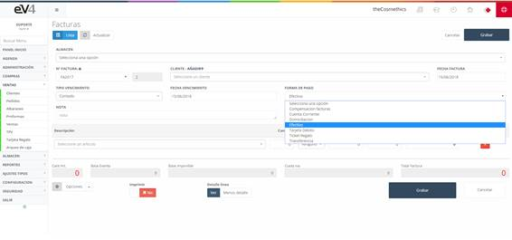
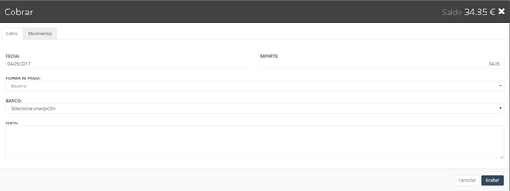

# Sales

These are the sales generated when purchasing the products of our company. Upon entering for the first time, we see a list of all generated sales, along with a small filter for searching them.

[Watch this video!](https://www.loom.com/share/e24f4bf2bcd0410fb5f2f6569a1293ea?sid=84cab7bf-03d4-4257-9aa8-46cd7e26db82)

## Convert Delivery Note into Invoice

This is the initial view of the **“INVOICES”** section. Initially, the search fields are left blank by default. When we perform a search, the fields will retain the values entered, in case we need to repeat a search with these same parameters.

If we want to reset the template to its initial state and clear the data from the last search, we can do so by pressing the **"Reset"** button.

## New Invoice

Initial view of the **“INVOICES”** template.

To create a new sale, we select the **WAREHOUSE**, the **invoice series** in the **"INVOICE NO."** field, the **CLIENT** to whom the invoice is issued, and the **issue date** of the invoice in the **"INVOICE DATE"** field.

The **"DUE TYPE"** field allows us to select the payment due type: **cash**, or **30**, **60**, or **90 days**.

The **"DUE DATE"** field allows us to set the due date for the invoice.

In the photo, we observe the **"PAYMENT METHOD"** field, which, when clicked, allows us to select the payment method for the invoice.

To enter the catalog more quickly, we can do so by scanning the **barcode** of the product with a barcode reader. This will bring the product and its details. Additionally, if we click on the **"LINE DETAIL"** button, it will give us the option to add further details to the product.

To **print the invoice** and send it, the process is the same as outlined in previous sections.

In the new **"SALE/INVOICE"** form, we can find a button labeled **"Delivery Notes"** within the **"Options"** dropdown menu.

When clicked, a pop-up window will appear with the **delivery notes** assigned to the selected client in the form. Here, we select the delivery notes we want to import and click **accept**. This will automatically import all the lines from the selected delivery notes into our invoice.

Another feature in the **Options** dropdown menu is the option to **apply a discount**. When we select this option, a pop-up window will appear to input a percentage that will be deducted from the total price.

Finally, there is the possibility to **access the agenda** directly from the new invoice screen, allowing us to schedule an appointment with the client.

Once the invoice is generated, the view will look like the following image, with the addition of a new **"Collect Invoice"** button.

To **collect the invoice**, click the new button, and a window like the following will appear:

In the **Collect Invoice** image, we see two tabs: 
- **Collection**, where we will input the payment method details from the client for the invoice.  
- **Movements**, which includes a list of payments for that invoice.
