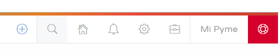
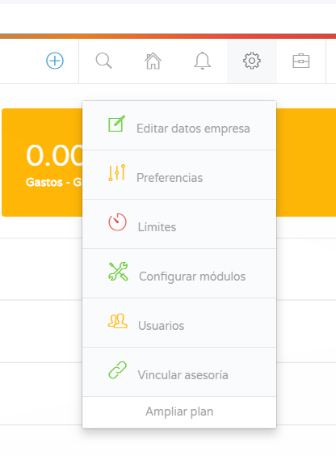
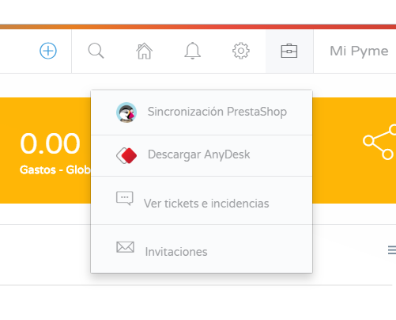
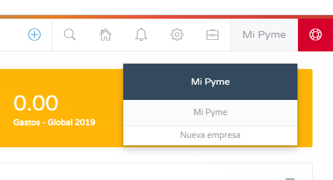
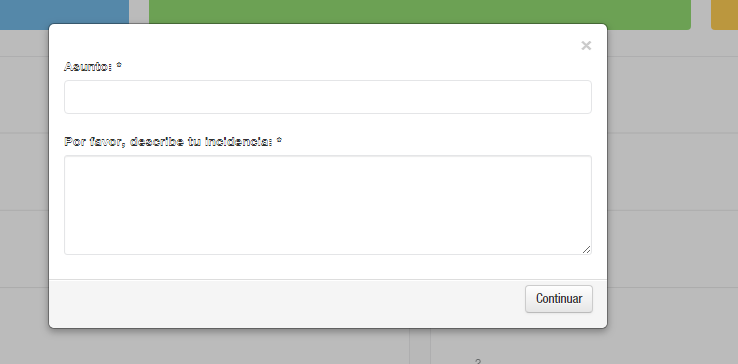
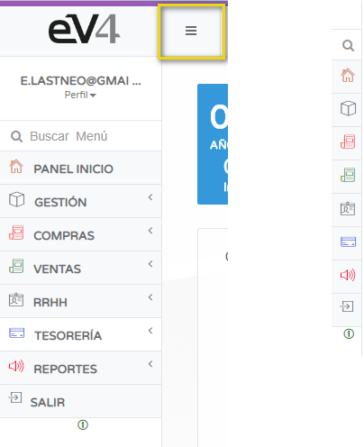

---

title: Interface  
description: Our software will allow you to manage your business more efficiently. Let's quickly explore the eV4ERP interface.  
---

#### Welcome to eV4ERP, we make the complex simple

Our software will allow you to manage your business more efficiently. Let's quickly explore the eV4ERP interface.

eV4ERP has two toolbars.

#### 1. TOP RIGHT BAR

In the top right corner of the screen, we have the quick access toolbar:

This toolbar provides eight quick access buttons to different functions that we can execute with just one click, saving time while working. These buttons are from left to right:

- **Ꚛ**: The "+" button allows us to create a new customer, a new sales invoice, a new ticket, a new supplier, a new purchase invoice, or access reports with a single click.

- **SEARCH**: The magnifying glass button lets us search (for items, customers, suppliers, etc.) in the eV4ERP database.

When clicked, a window will open where we can enter the search terms, and the results will appear below.

- **HOME PANEL**: The house symbol button takes us directly to the home panel.

- **NOTIFICATIONS**: The bell symbol button opens a dropdown panel with the notifications we have in the system.

- **CONFIGURATION**: The gear symbol button gives us access to 7 options to configure eV4ERP.

- **TOOLS**: The briefcase symbol button gives us access to 4 tools:  
  - Synchronization with PrestaShop (if contracted)
  - Download Anydesk (Remote management software)
  - View tickets and incidents
  - Invitations

- **COMPANY**: The button with the company name gives us access to configure or modify the company's details.

- **SUPPORT**: The last red button allows us to send an assistance ticket to the support department.

#### 2. LEFT COLUMN

In the left column, we have the menu that gives us access to all eV4ERP functions. This panel can be expanded or hidden by clicking the button with three horizontal lines.

- **SEARCH BAR**: In this panel, we have a search bar that allows us to search different menu sections by typing their name.

- **HOME PANEL**: This button will take us to the home panel from any section of the app.

Next, we will have access to all the contracted functionalities. In this example:

- **MANAGEMENT**: We can manage the catalog.
- **PURCHASES**: We can manage suppliers, delivery notes, and purchases.
- **SALES**: We can manage customers, orders, delivery notes, quotes, and invoices.
- **HR**: We can manage employees, work centers, and payrolls.
- **TREASURY**: We can manage cash drawers and bank accounts.
- **REPORTS**: We can view different reports.
- **LOG OUT**: This button allows us to exit the application.
