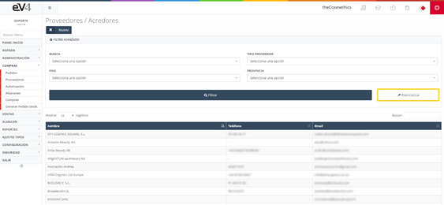
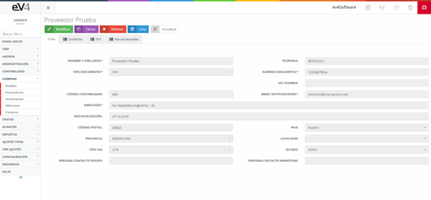

---

title: Suppliers  
description: List of suppliers from whom the products sold by the company are sourced.  
---

#### Suppliers

This section contains the list of suppliers from whom the products sold by the company are sourced.

This is the initial view of the “SUPPLIERS” section. By default, the search fields are empty. When a search is performed, the fields will retain the values entered, in case it is necessary to repeat a search with these data.

If we want to reset the template and clear the last search data, we can do so by clicking the “Reset” button.

Within the supplier details, in addition to the various fields to complete about the supplier, there are several tabs, such as the supplier contacts and any PDF files or related documents we wish to save.

To add a new supplier, we must click the “NEW” button, which will show us the form seen in the image above, but this time to fill in the fields:

#### Suppliers – New

- **Name and surname**: If it's a company, we enter the name; for an individual, we enter the first name and last name.
- **Phone**: General contact phone number.
- **Document type**: Type of document (NIF, NIE, DNI, etc.).
- **Document number**: Number of the selected document type.
- **VAT NUMBER**: VAT number.
- **Accounting code**: Treasury code.
- **Notification email**: Supplier’s email.
- **Address**: Supplier’s address.
- **Geolocation**: Supplier’s address in coordinates.
- **Postal code**: Supplier’s postal code.
- **Country**: Country where the supplier is located.
- **Province**: Province where the supplier is located.
- **Town**: Town where the supplier is located.
- **VAT type**: VAT type with which the supplier works.
- **Status**: Supplier’s status.
- **Contact person for orders**: Supplier’s contact person for orders.
- **Contact person for marketing**: Supplier’s contact person from the marketing department.

