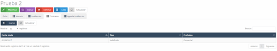

#### Contracts

In the "Contracts" tab, we find the contracts made with an employee throughout their employment at the company.

#### Adding a New Contract

To add a new contract, click on the "New" button, which will take you to a new screen with a form to fill out with the following fields:

- **Contract Type**: The type of contract for the employee.
  
- **Start Date**: The start date of the contract.
  
- **End Date**: The end date of the contract.
  
- **Position**: The job position held by the employee.
  
- **Profession**: The profession exercised by the employee.
  
- **Notes**: Any clarifying notes about the job.
  
- **Documentation**: Allows you to upload PDFs or images, such as the contract or any document associated with it.

