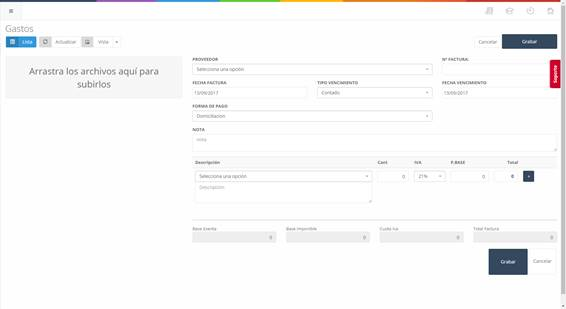

# Expenses

This section collects the expenses related to the company, such as water, electricity, etc.

In the initial screen (**see Image 14: Administration - Expenses - Expense List**) of this section, we find the list of invoices related to the expenses entered into the system, along with search filters and a button that allows adding a new expense (**Button "New"**).

## Expenses – New

To create a new expense, we need to click the **"New"** button on the initial expenses screen (**see Image 14: Administration - Expenses - Expense List**). This will take us to a new screen (**see Image 15: Administration - Expenses – New**) where we can add the new expense to the system.

### Add an Expense  

To add the expense to the system, we must fill in the form fields and click the **"Save"** button.  

- **Supplier**: Supplier of the item or expense.  
- **Invoice No.**: Number assigned to the invoice for identification.  
- **Invoice Date**: Date the invoice was issued.  
- **Payment Type**: Payment method for the invoice.  
- **Due Date**: Due date of the invoice.  
- **Note**: Additional information if required.  
- **Description**: Name of the item or expense.  
- **Quantity**: Quantity of items for a product or expense.  
- **VAT**: VAT corresponding to an expense or product.  
- **Base Price**: Base price of an expense or product.  
- **Total**: Total price of an expense or product.
