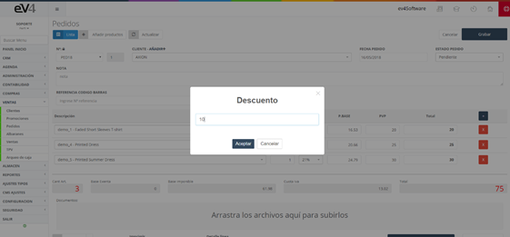
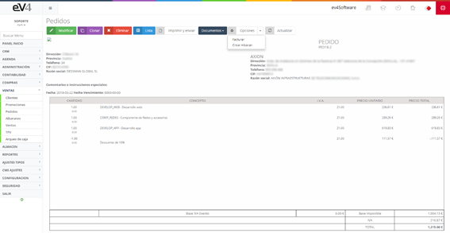

#### Orders

This section contains all the orders made by different customers to our company.  

The first thing we see when we enter is the list of all orders made and a filter that facilitates the search of these orders, allowing filtering by **dates, customer, or order status**. 

#### Initial View of the "ORDERS" Section

This is the initial view of the **"ORDERS"** section. Initially, the search fields are blank by default. When we perform a search, the fields will retain the values entered so that we can easily repeat a search related to these data if necessary.  

If we want to restore the initial state of the template and clear the data from the last search, we can do so by clicking the **"Reset"** button.  

When creating a new order, the process is exactly the same as in **purchase orders**, with the difference being that, instead of selecting a supplier, this time we select the **customer** placing the order.

#### Discounts in Orders  

In the **"Options"** dropdown, we can select the **"Discount"** function, which will display a pop-up window where we can enter a percentage to be applied as a discount on the total. 

It will show the following window:

#### Printing and Managing Orders  

If we select the option to **print** an order, a window similar to the one in **purchase orders** will appear, allowing us to **print it** and send it by **email**.  

Just like in **purchase orders**, this section works the same way and has the same view type. We can:  

- **Create the delivery note** from the generated order.  
- **Rectify** the order.  
- **Print it and send it by email**.  
- View a **list of attached documents**.  

#### General View of an Order  

Let’s take a look at what the general view of an order would look like:  

#### Order Status Once Accounted

Once the order has been **accounted** by the system and the **stock has been deducted**, the order becomes **locked**, and no further modifications are possible.

Once the order has been **accounted** by the system and the **stock has been deducted**, the order becomes **locked**, and no further modifications are possible.
