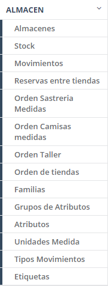

#### WAREHOUSE

In this section of the system, we find the company’s functionalities associated with **warehouses** (**see Image 75: Warehouse – Menu**), such as the **catalog**, **movements**, and **families**, among others.

Within this section, we can see the different warehouses we have (see Image 76: Warehouse - Warehouses - List).

#### Warehouses – New

To create a new **warehouse** or **center**, we need to click on the **New** button in the initial **warehouses** screen (**see Image 76: Warehouse - Warehouses – List**). When we click the button, a screen will appear with a form to fill out with the warehouse’s information (**see Image 77: Warehouse - Warehouses – New**).

#### Fields to Fill Out to Create a Warehouse

The fields to fill out are:

- **Name**: Name of the warehouse or center.  
- **Phone**: Phone number of the warehouse or center.  
- **Address**: Address of the warehouse or center.  
- **Postal Code**: Postal code of the locality where the warehouse or center is located.  
- **City**: City where the warehouse or center is located.  
- **Country**: Country where the warehouse or center is located.  
- **Province**: Province where the warehouse or center is located.  
- **Locality**: Locality where the warehouse or center is located.  
- **Inventory Management**: Method to be used for managing the inventory.  
- **Warehouse Manager**: Person responsible for the warehouse or center.  
- **Note**: Informational note about the warehouse or center.  
- **Geolocation**: Corresponds to the geographic coordinates of the center.

Once we have filled in the fields, we need to click the **Save** button to ensure the new warehouse is saved in the system.
