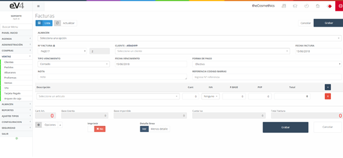

# Sales

These are the sales generated from the purchase of the company's products. When entering for the first time, we see the list of all the generated sales, along with a small filter for searching them.

## Initial View of the "INVOICES" Section

This is the initial view of the **"INVOICES"** section. Initially, the search fields are blank by default. When we perform a search, the fields will retain the entered values in case we need to repeat a search with this data.

If we want to reset the initial state of the template and delete the data from the last search, we can do so by clicking the **"Reset"** button.

## New Invoice

Initial view of the **"INVOICES"** template.

### Create a New Sale

To create a new sale, we select the **WAREHOUSE**, the **invoice series** in the **"INVOICE NO."** field, the **CLIENT** to whom it is addressed, and the **issue date** of the invoice in the **"INVOICE DATE"** field.

The **"DUE TYPE"** field allows us to select the due type: **cash**, or **30**, **60**, or **90 days**.

The **"DUE DATE"** field allows us to set the due date of the invoice.

In the picture, we can see the **"PAYMENT METHOD"** field, which, when clicked, allows us to select the **payment method** for the invoice.

To input the catalog more quickly, we can do so by entering the **barcode** of the product using a barcode scanner. This will bring up the product and its details. Additionally, if we click on the **"LINE DETAIL"** button, we will have the option to add more details to the product.

To **print** the invoice and send it, the process is the same as in previous sections.

In the new **"SALE/INVOICE"** form, we can find a **"Delivery Notes"** button within the **"Options"** dropdown menu.

Clicking it will open a pop-up window with the **delivery notes** assigned to the selected **client** in the form. We select the delivery notes we wish to import and click **accept**. This will automatically import all the lines from the selected delivery notes into our **invoice**.

Another feature in the dropdown menu is the option to add a **discount**. When we click this option, a pop-up window will appear to enter a percentage that will be deducted from the total price.

Lastly, there is the possibility to access the **agenda** from the new invoice screen, allowing us to schedule an appointment with the client.

Once the invoice is generated, the view will look like the following image, with the addition of a new **"Collect Invoice"** button.

To **collect the invoice**, click on the new button, and a window will appear as follows:

In the **Image: Collect Invoice**, we see two tabs:

- **Collection**: Where we enter the payment details for the invoice by the client.
- **Movements**: Includes a list of the payments for that invoice.
