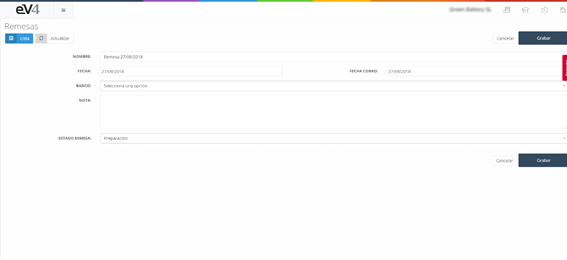
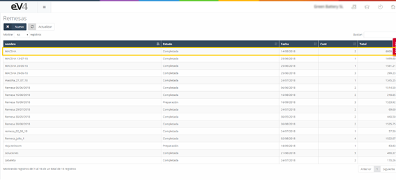
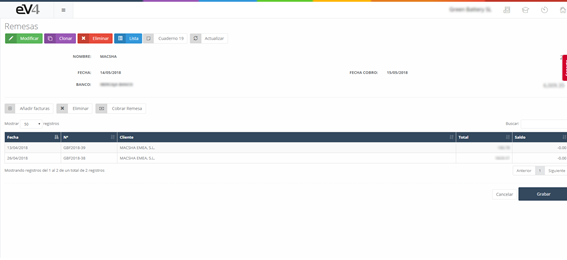

#### Remittances

A remittance is basically a document used to settle the purchase of any type of merchandise. It is a financial document through which we give the order to our bank to manage the collection or payment of the transaction we have made. In other words, it is a file in which one or several sets of receipts are handed over to our bank, and thus, it manages the collection of all the documents we are requesting.

Once we have the remittance document, we must send it to our bank to proceed with the collection or payment of them.

##### For example:

Let’s imagine that we are a company and we want to pay our suppliers, 10 of them, to settle debts. We will create a remittance with all the fields explained below – where the amounts, supplier, date, etc. are detailed – and we will send it to the bank. The bank will then be responsible for paying them all, without us having to make each individual transfer. This is the payment order. This way, the payments for those invoices we want to settle will be done.

##### How do remittances work?

When we talk about income remittances, that is, collections, we are giving an order for those collections to our bank to execute. At that moment, the balance of our bank account increases, and the balance of the clients we just collected from is canceled.

When we talk about expense remittances, that is, payments, we are giving an order to our bank to pay those debts. At that moment, our bank balance decreases, meaning our treasury drops, and the pending balances with suppliers are cleared.

Once this is done, we have managed our collections and payments.

When we enter the "REMITTANCES" section, we see the following screen:

Where we have a list of the remittances that have been created in the system.

To create a new Remittance, we click the "NEW" button.

We must fill in the following fields:

- **NAME**: The name with which we will identify the remittance.
- **DATE**: The creation date of the remittance.
- **COLLECTION DATE**: The collection date of the remittance.
- **BANK**: The bank account where the amount of the remittance will be debited or credited. If we click on this field, a dropdown will open, allowing us to choose one of the accounts already configured in the application.

- **NOTE**: In this field, we can add a small description for informational purposes.
- **REMITTANCE STATUS**: If we click on this field, a dropdown will open where we can select one of the following statuses: Completed, Sent, and In Preparation.

Once we have filled in all the fields, we click the "SAVE" button to store the remittance in the system.

Once we are in the general view of the "REMITTANCES" section, to consult a remittance, we just have to click on it.

And we will see the invoices or receipts that make up the remittance.

Now let's take a closer look at the function of the following buttons:

- **Add Invoices**: This button allows us to add invoices to the remittance.

When we click this button, another window will open, showing the list of available invoices to add to the remittance. Refer to the end of the section for the configuration of invoices to display.

To select an invoice, we click on it, and it will be highlighted in gray. We repeat this process with all the invoices we want to add. To finish, we click the **“Add”** button, and the selected invoices will be included in the remittance.

If we click the **“Back to invoices in remittance”** button, we will return to the previous screen.

- **Delete**: This button allows us to remove invoices from the remittance.

When we click this button, it will change color and turn red. We select the invoices we want to remove from the remittance, and they will be marked in gray. To delete them from the remittance, we click the **“Delete”** button. The remittance will be modified, and the changes will be stored in the system.

