The **POS** is the panel for managing sales in the company's physical store to a customer in an easy and simple way.

Upon accessing it, we find a list of all the invoices generated, whether manually from the sales section or from the POS itself, along with a filter to facilitate searching for them.

This is the initial view of the **“POS”** section, where the search fields are blank by default. When we perform a search, the fields will retain the values entered, in case we need to repeat a search related to this data.

If we want to reset the template to its initial state and clear the data from the last search, we can do so by clicking the **“Reset”** button.

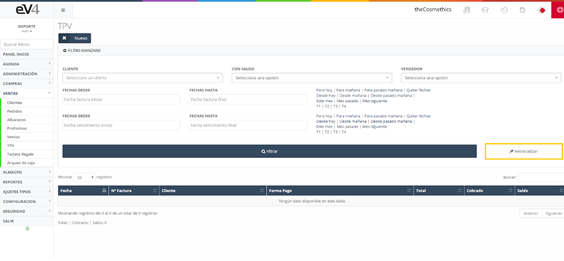

#### NEW POS

The operation of the panel is similar to the sales section from the previous part, but in this case, the entire layout has been modified for a more user-friendly experience.

Initially, we see the simplified view of the **POS** screen. If we want to access the full view of this screen, we should go to the dropdown button **“Options”** located at the bottom-right of the screen.

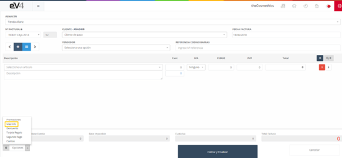

And select the option **“More Info”**. We will see the fields: **“Due Type”** and **“Due Date”** appear.

First, let's take a look at some important buttons in the **“New POS”** section:

- **New POS Button (+)**: A blue button with a white + symbol located at the top left of the screen, below the **“INVOICE Nº”** field. Its function is to create a **new ticket**, i.e., it clears all the fields on the screen and resets them to their initial state.

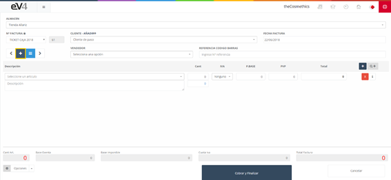

- **List Button**: A light blue button with three white horizontal lines. It is located next to the **“NEW POS”** button. Its function is to return to the initial **“POS”** section.

- **Forward/Back Buttons**: Buttons located on the left and right of the previous two buttons. These buttons allow us to load the previous/next ticket on the screen and navigate between them.

- **Add Item Button**: A smaller blue button with a white + symbol located at the top right of the screen. The function of this button is to add a new line to the ticket to include another item.

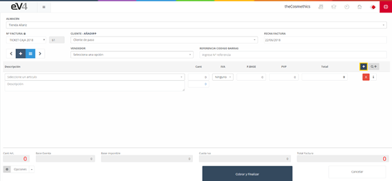

- **Delete Button (x)**: A red button with an "x" symbol. This button deletes a product line from the invoice or ticket. If more lines have been added than necessary or if you want to remove an existing line, click this button, and that line will be removed.

- **Info Button (i)**: A white button with a lowercase "i" inside. The "INFO" button gives us information about the product referenced by that line on the ticket or invoice.

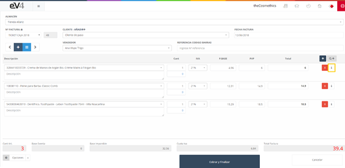

If we click on it, a popup window will appear with the product's information.

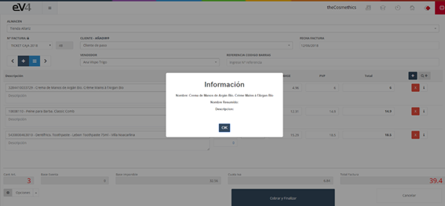

To close this window, click the "OK" button.

- **Consult Catalog Button (Q+)**: A gray button with the Q+ symbol located to the right of the "Add Item" button. This button is very practical. To add an item to the ticket, if we do it from the default search field, it only allows us to search by name. With this button, we can search for an item by the following criteria:

  - **NAME**:
  
  - **REFERENCE**:
  
  - **EAN-13**:
  
  - **BRAND**:
  
  - **SUPPLIER**:

Let's take a closer look at how this button works.

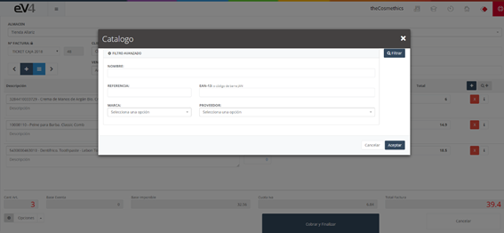

- **NAME**:

  To search for an item by name, we write it in the "NAME" field.

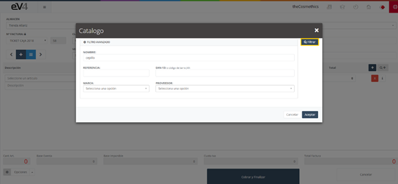

  Click the "FILTER" button to show the results.

Now, to add an item to the ticket or invoice, we double-click on it.

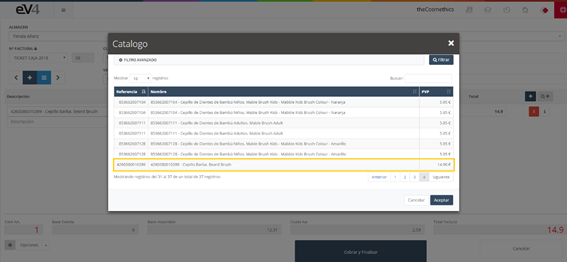

Each time we double-click on an item, an additional unit of it will be added to the ticket or invoice.

- **REFERENCE**:

We can search by "REFERENCE", write the reference of an item in the corresponding field, and click the "FILTER" button.

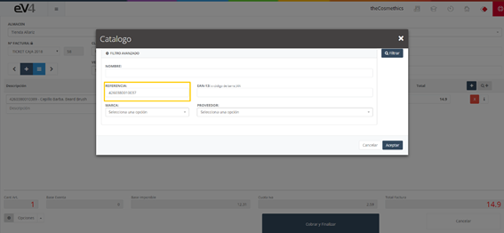

The system will show us the matches:

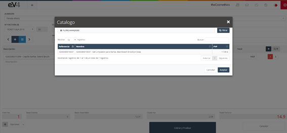

To add the item to the ticket, we double-click on it.

- **EAN-13 (or JAN barcode)**:

The process is exactly the same as for the "REFERENCE" field.

- **BRAND**:

We can search by "BRAND": Click on the "BRAND" field, and a dropdown will appear where we can type the name of the brand to filter the search, or we can select one from the list. Select a brand and click the "FILTER" button.

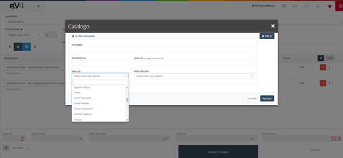

The system will show a list of all items from the selected brand that we have registered.

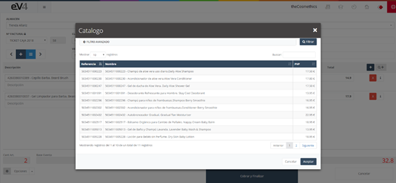

To add an item to the ticket, double-click on it.

- **SUPPLIER**:

We can search by "SUPPLIER": Click on the "SUPPLIER" field, and a dropdown will appear where we can type the name of the supplier to filter the search or select one from the list. Select a supplier and click the "FILTER" button. The system will show a list of all items from the selected supplier that we have registered. To add an item to the ticket, double-click on it.

All of these search criteria can be combined for more precise searches.

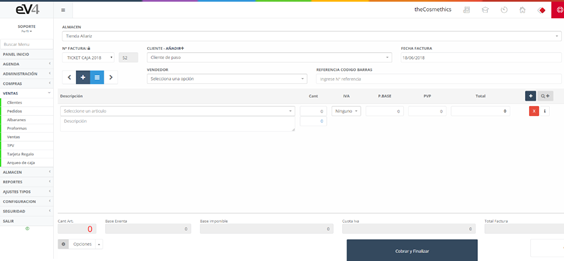

Let's look at the fields available in the POS window:

- **Invoice Nº:** In this field, we can select the series to which the generated invoice will belong.
- **Client – Add+:** Allows us to select the client for whom the invoice will be issued.
- **Invoice Date:** Allows us to set the invoice date.
- **Due Type:** Allows us to select whether the invoice will be paid in cash or in 30, 60, or 90 days.
- **Due Date:** Allows us to set the invoice's due date.
- **Seller:** Allows us to select the seller to whom the sale will be assigned.
- **Barcode Reference:** Allows us to scan the barcode of a product using an external scanner or type it manually.
- **Item:** We have a different line for each item included in the invoice.

Now, let's take a closer look at the options available through the "Options" button.

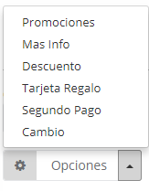

The available options are:

- **Promotions:** Allows us to select an active promotion.
- **More Info:** Allows us to switch from the simplified view to the full view and vice versa in the POS window.
- **Discount:** Allows us to apply a discount to the invoice.
- **Gift Card:** Allows us to add a gift card to the invoice.
- **Second Payment:** Allows us to set a second payment for the invoice.
- **Change:** Shows the change to be given to the customer.
